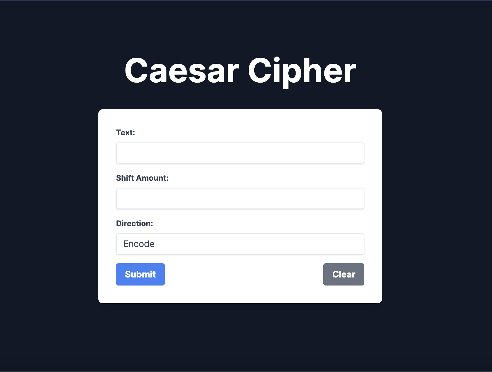
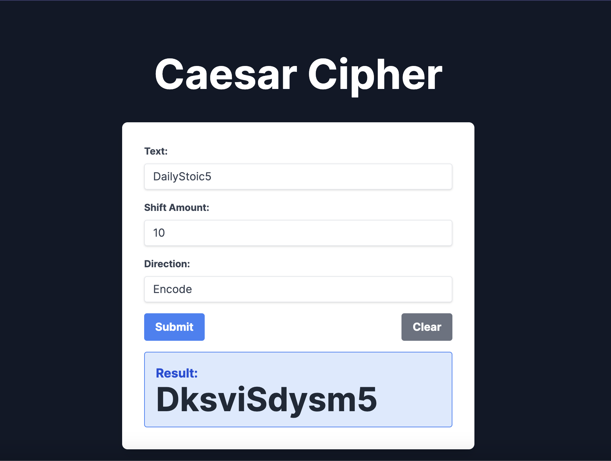

# Caesar Cipher App




This is a Next.js application that allows users to encode and decode text using the Caesar Cipher algorithm.

## Description

The Caesar Cipher App provides a simple interface where users can enter their desired text and choose to encode or decode it. The application then encrypts or decrypts the text using the Caesar Cipher algorithm based on the selected options.

## Functionality

- Users can enter the text they want to encode or decode.
- They can specify the shift amount for the encryption/decryption process.
- Users can select the direction (encode or decode) for the cipher operation.

## How it Works

The application utilizes a Next.js backend to handle the cipher operations. The API endpoint `/api/cipher` receives the text, shift amount, and direction, and then performs the Caesar Cipher algorithm to encode or decode the text accordingly.

## Sample API Implementation

```typescript
import { NextRequest, NextResponse } from "next/server";

export async function POST(request: NextRequest) {
    const { text, shift_amount, direction } = await request.json();

    // Validation checks...

    const result = caesarCipher(text, shift_amount, direction);
    return NextResponse.json({ result }, { status: 200 });
}

function caesarCipher(text: string, shift_amount: number, direction: string): string {
    // Cipher implementation...
}
```

## Sample Design Implementation

The front-end design is implemented using Framer Motion for animations and form handling.

```typescript
import { motion } from 'framer-motion';
import { useCipher } from './useChiper';

// InputForm component...

export default InputForm;

```

## Schema Validation

Data passed to the API is validated using Zod schemas.

```typescript
import { z } from "zod"

export const cipherSchema = z.object({
    text: z.string().min(1, { message: "Text is required" }),
    shift_amount: z.number().min(1, { message: "Shift amount must be at least 1" }),
    direction: z.enum(['encode', 'decode']),
}).superRefine((data, ctx) => {
    if (!['encode', 'decode'].includes(data.direction)) {
        ctx.addIssue({
            code: z.ZodIssueCode.custom,
            message: "Direction is invalid",
            path: ["direction"],
        });
    }
}); 

```

## Live Link
 - [Live link](https://main--ecaesar-cipher-encrypt.netlify.app/)

## Installation
 - Clone the repository
 - Navigate to the project directory
 - Install the dependencies with `npm install`
 - run the application using `npm run dev`


## Usage
- Open the application in your browser.
- Enter the text you want to encode or decode.
- Choose whether to encode or decode the text.
- The resulting text will be displayed in real-time.


## Contributing
Contributions are welcome! Please fork the repository and submit a pull request.


## License
This project is licensed under the MIT License - see the LICENSE file for details.